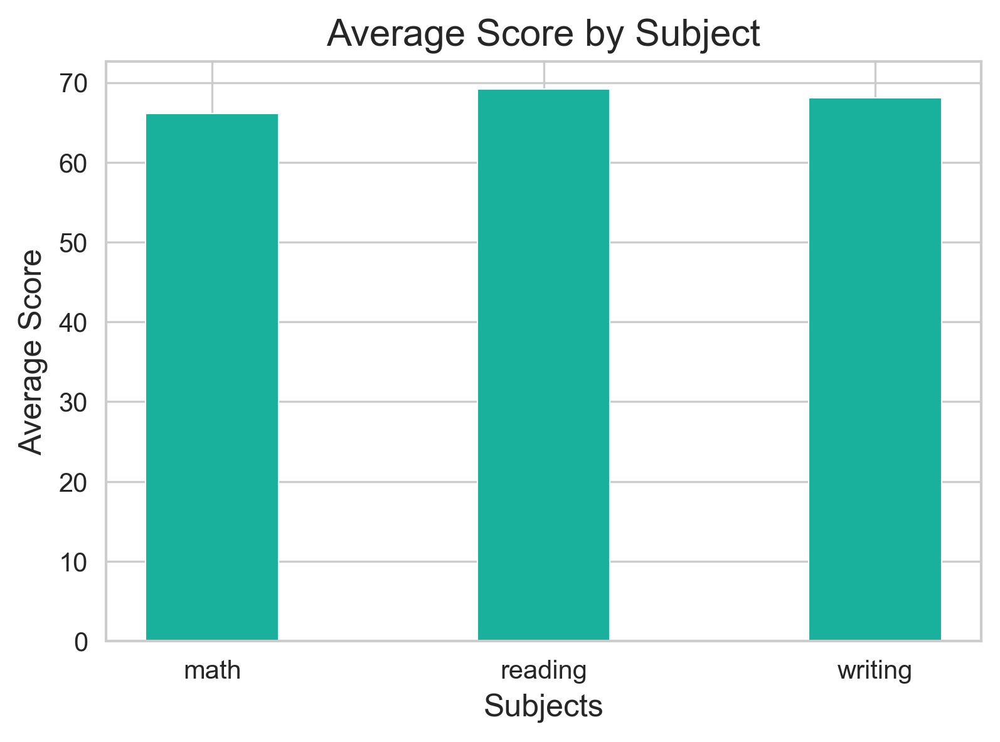
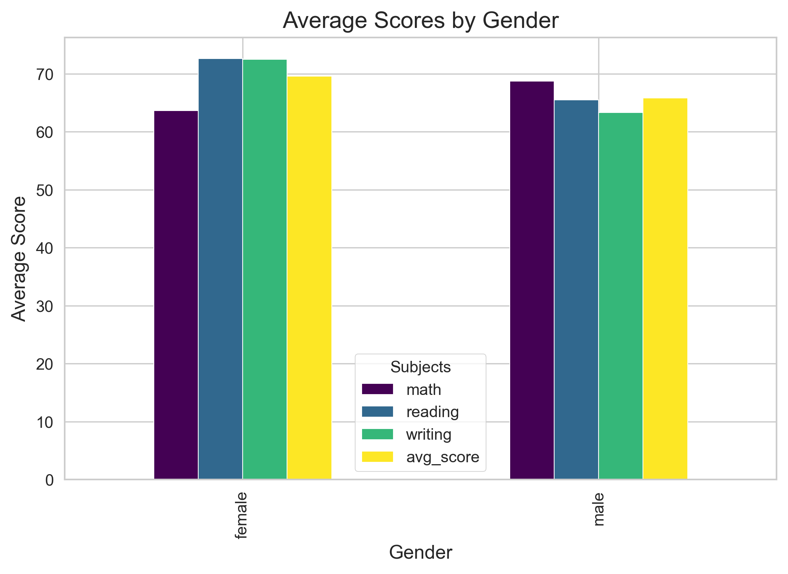
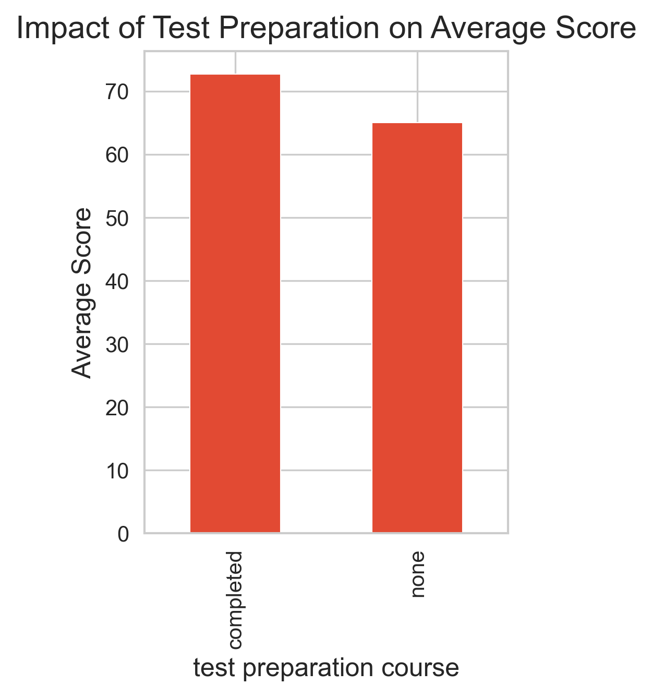
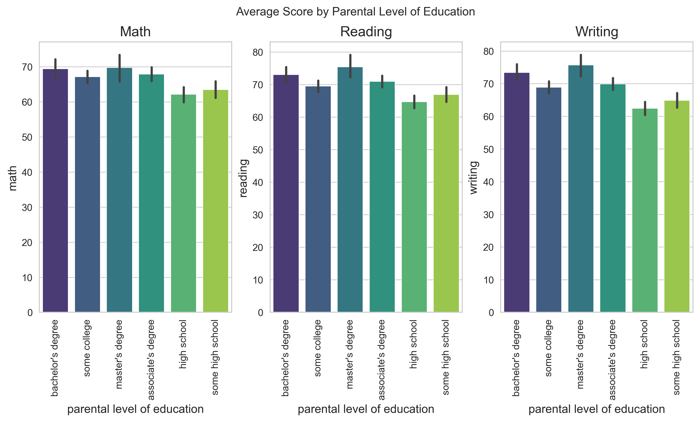
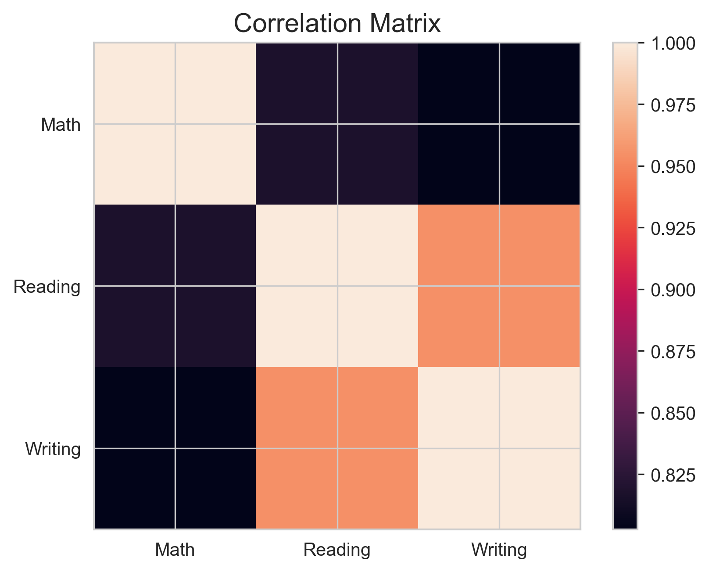

# 📊 Student Performance Analysis

## 📌 Overview
This project performs **Exploratory Data Analysis (EDA)** on a student examination dataset to uncover trends, performance patterns, and relationships between academic scores and influencing factors.

The analysis evaluates student achievement across **Mathematics, Reading, and Writing**, while examining the impact of demographic and socio-academic variables.

---

## 🎯 Objectives
- Assess overall student performance across subjects  
- Compare subject-wise average scores  
- Analyze score distributions and variability  
- Investigate influencing factors:
  - Gender
  - Test Preparation Course
  - Parental Level of Education
  - Race/Ethnicity
- Perform correlation analysis  
- Engineer performance metrics (Total & Average Score)

---

## 🧰 Tools & Technologies
- Python  
- NumPy  
- Pandas  
- Matplotlib  
- Jupyter Notebook / Google Colab  

---

## 📊 Score Distribution

**Insight:**  
Math scores show greater variability, while Reading and Writing cluster toward higher ranges.

---

## 📈 Average Score by Subject

**Insight:**  
Reading and Writing outperform Mathematics on average.

---

## 👩‍🎓 Gender-Based Performance

**Insight:**  
Female students tend to score higher in Reading and Writing.

---

## 🎯 Impact of Test Preparation

**Insight:**  
Students completing test preparation courses consistently achieve higher scores.

---

## 👨‍👩‍👧 Parental Education Influence

**Insight:**  
Students with higher parental education levels generally achieve better academic scores.

---

## 🔗 Correlation Analysis

**Insight:**  
Strong positive correlation observed between Reading and Writing scores.

---

## 🔍 Key Findings
- Reading & Writing scores exceed Math scores on average  
- Math performance shows higher dispersion  
- Test preparation significantly improves results  
- Parental education level influences performance  
- Strong Reading–Writing relationship  

---

## 🚀 Outcome
This project demonstrates how **EDA and visualization techniques** transform raw educational data into meaningful insights.

---

## 📁 Repository Contents
- `Student_Performance_Analysis.ipynb` → Full analysis  
- `StudentsPerformance.csv` → Dataset  
- `images/` → Visualizations  
- `requirements.txt` → Dependencies  

---

⭐ *If you found this project useful, consider giving it a star!*
